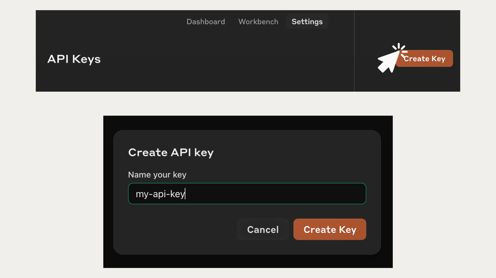

# Getting started with the Claude SDK

## Lesson goals
In this first lesson, you'll learn how to:
* install the necessary packages and authenticate with the API
* make your first request to the Claude AI assistant 

## Installing the SDK

Before diving into the SDK, make sure you have Python installed on your system. 

The Claude Python SDK requires Python 3.7.1 or later. 

You can check your current Python version by running the following command in your terminal:

```
python --version
```

If you don't have Python installed or your version is older than 3.7.1, please visit the [official Python website](https://www.python.org) and follow the installation instructions for your operating system.

With Python ready, you can now install the Anthropic package using pip 


```python
# Use this command if installing the package from inside a notebook
%pip install anthropic 
#Use this command to install the package from the command line
# pip install anthropic
```

## Getting an API key

To authenticate your requests to the Claude API, you'll need an API key.

Follow these steps to obtain your API key:

1. If you haven't already, sign up for an Anthropic account by visiting https://console.anthropic.com 
2. Once you've created your account and logged in, navigate to the API settings page. You can find this page by clicking on your profile icon in the top-right corner and selecting "API Keys" from the dropdown menu, or by navigating to the "API Keys" menu in the Settings tab.
3. On the API settings page, click on the "Create Key" button. A modal window will appear, prompting you to give your key a descriptive name. Choose a name that reflects the purpose or project you'll be using the key for. You can create as many keys as you want within your account (note that rate and message limits apply at the account level, not the API key level).
4. After entering a name, click on the "Create" button. Your new API key will be generated and displayed on the screen.
   > Make sure to copy this key, as you won't be able to view it again once you navigate away from this page.  



Remember, your API key is a sensitive piece of information that grants access to your Anthropic account. Treat it like a password and never share it publicly or commit it to version control systems like Git.


## Safely storing your API key

While you can hardcode your API key directly in your Python scripts, it's generally considered best practice to keep sensitive information, like API keys, separate from your codebase. One common approach is to store the API key in a `.env` file and load it using the `python-dotenv package`. Here's how you can set it up:

Create a new file called `.env` in the same directory as your notebook.


Add your API key to the newly created `.env` file using the following format: 

```
ANTHROPIC_API_KEY=put-your-api-key-here
```

Make sure to save the `.env` file

Install the python-dotenv package by running the following command in your terminal or notebook:


```python
#To install the package from a notebook: 
%pip install python-dotenv

#To install the package from your terminal:
# pip install python-dotenv
```

We can now load the API key from the .env file using the `load_dotenv()` function from the dotenv module with the following code:


```python
from dotenv import load_dotenv
import os

load_dotenv()
my_api_key = os.getenv("ANTHROPIC_API_KEY")

```

## Making basic requests with the client

With the `anthropic` package installed and your API key loaded, you're ready to start making requests to the Claude API. 

The first step is to create a client object, which serves as the main entry point for interacting with the API.


```python
from anthropic import Anthropic

client = Anthropic(
    api_key=my_api_key
)
```

Note that the `anthropic` SDK automatically looks for an environment variable called "ANTHROPIC_API_KEY", so you don't actually have to pass it in manually and can instead just do this:

```py
from anthropic import Anthropic

client = Anthropic()
```

Now that we have our client instantiated, it's time to make our first request.

To send a message to Claude and receive a response, we'll use the `messages.create()` method of the `client` object. 
We'll talk about the specific parameters and response format in the next lesson.  For now, try running the following code and you should get your first message back from Claude! 


```python
our_first_message = client.messages.create(
    model="claude-3-haiku-20240307",
    max_tokens=1000,
    messages=[
        {"role": "user", "content": "Hi there! Please write me a haiku about a pet chicken"}
    ]
)

print(our_first_message.content[0].text)

```

    Feathered friend clucking,
    Scratching in the dirt all day,
    Loyal pet chicken.


***

## Exercise

We've only just begun, so this exercise might feel a little underwhelming. It's always good to get some practice with the basics.

Please do the following: 
1. Create a new notebook or Python script.
2. Import the proper packages
3. Load your Anthropic API key
4. Ask Claude to tell you a joke and then print out the result (you can copy/paste the code above and tweak it)

***
