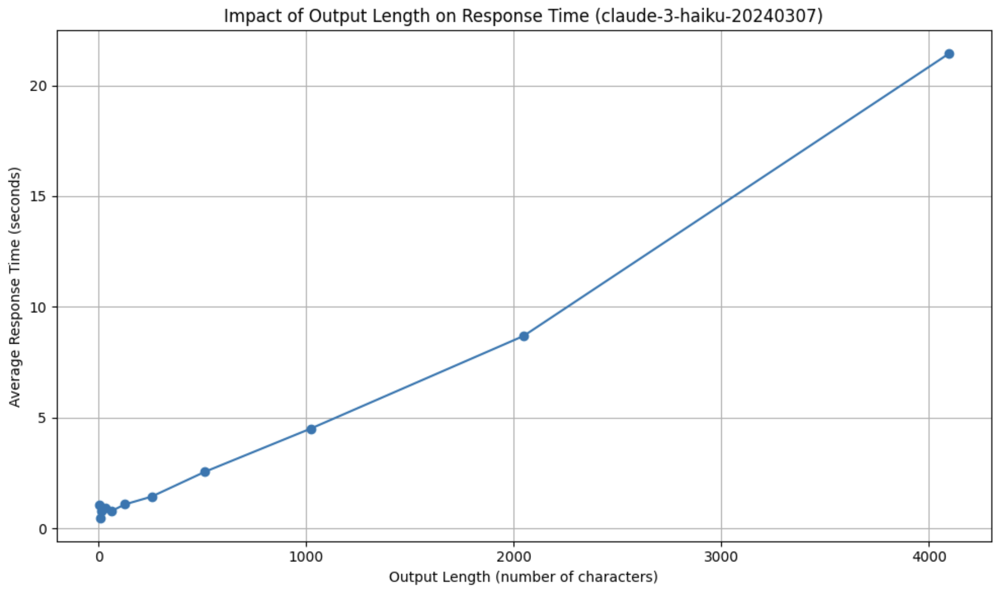
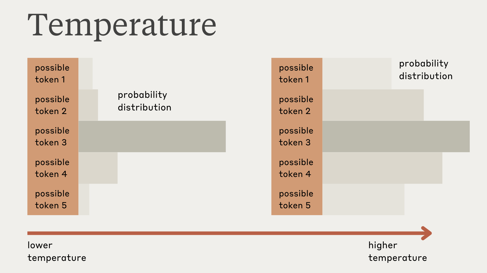
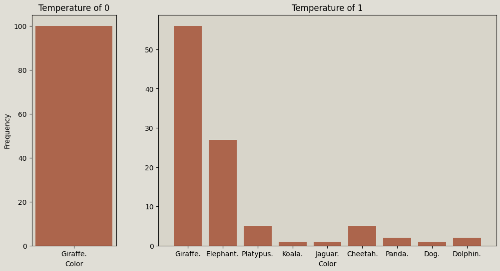

# Model parameters

## Lesson goals
* Understand the role of the `max_tokens` parameter
* Use the `temperature` parameter to control model responses
* Explain the purpose of `stop_sequence`

As always, let's begin by importing the `anthropic` SDK and loading our API key:


```python
from dotenv import load_dotenv
from anthropic import Anthropic

#load environment variable
load_dotenv()

#automatically looks for an "ANTHROPIC_API_KEY" environment variable
client = Anthropic()
```

## Max tokens

There are 3 required parameters that we must include every time we make a request to Claude: 

* `model`
* `max_tokens`
* `messages`

So far, we've been using the `max_tokens` parameter in every single request we make, but we haven't stopped to talk about what it is. 

Here's the very first request we made: 

```py
our_first_message = client.messages.create(
    model="claude-3-haiku-20240307",
    max_tokens=500,
    messages=[
        {"role": "user", "content": "Hi there! Please write me a haiku about a pet chicken"}
    ]
)
```

So what is the purpose of `max_tokens`?

### Tokens
In short, `max_tokens` controls the maximum number of tokens that Claude should generate in its response.  Before we go any further, let's stop for a moment to discuss tokens.

Most Large Language Models don't "think" in full words, but instead work with a series of word-fragments called tokens. Tokens are the small building blocks of a text sequence that Claude processes, understands, and generates texts with.  When we provide a prompt to Claude, that prompt is first turned into tokens and passed to the model.  The model then begins generating its output **one token at a time**.

For Claude, a token approximately represents 3.5 English characters, though the exact number can vary depending on the language used. 

### Working with `max_tokens`

The `max_tokens` parameter allows us to set an upper limit on how many tokens Claude generates for us. As an illustration, suppose we ask Claude to write us a poem and set `max_tokens` to 10.  Claude will start generating tokens for us and immediately stop as soon as it hits 10 tokens.  This will often lead to truncated or incomplete outputs. Let's try it! 


```python
truncated_response = client.messages.create(
    model="claude-3-haiku-20240307",
    max_tokens=10,
    messages=[
        {"role": "user", "content": "Write me a poem"}
    ]
)
print(truncated_response.content[0].text)
```

    Here is a poem for you:
    
    The


This is what we got back from Claude: 

>Here is a poem for you:
>
>The

If you run the above code, you'll likely get a different result that is equally truncated.  Claude started to write us a poem and then immediately stopped upon generating 10 tokens.  

We can also check the `stop_reason` property on the response Message object to see WHY the model stopped generating.  In this case, we can see that it has a value of "max_tokens" which tells us the model stopped generating because it hit our max token limit! 


```python
truncated_response.stop_reason
```


    'max_tokens'


Of course, if we try generating a poem again with a larger value for `max_tokens`, we'll likely get an entire poem:


```python
longer_poem_response = client.messages.create(
    model="claude-3-haiku-20240307",
    max_tokens=500,
    messages=[
        {"role": "user", "content": "Write me a poem"}
    ]
)
print(longer_poem_response.content[0].text)
```

    Here is a poem for you:
    
    Whispers of the Heart
    
    In the quiet moments,
    When the world fades away,
    I hear the whispers of my heart -
    Gentle words that gently sway.
    
    They speak of dreams still unfurled,
    Of love that shines like the sun,
    Of passions yet to be explored,
    Of all that's yet to be done.
    
    These whispers, they guide my way,
    Reminding me to pause and feel,
    To listen closely to the soul,
    And let its truths be revealed.
    
    For in the silence, in the calm,
    The heart's true voice can be heard,
    Weaving a tapestry of hope,
    With every softly spoken word.
    
    So I will heed these whispers dear,
    And let them be my faithful friend,
    For in their song, I find my way,
    To all my heart hopes to transcend.


This is what Claude generated with `max_tokens` set to 500:

```
Here is a poem for you:

Whispers of the Wind

The wind whispers softly,
Caressing my face with care.
Its gentle touch, a fleeting breath,
Carries thoughts beyond compare.

Rustling leaves dance in rhythm,
Swaying to the breeze's song.
Enchanting melodies of nature,
Peaceful moments linger long.

The wind's embrace, a soothing balm,
Calms the restless soul within.
Embracing life's fleeting moments,
As the wind's sweet song begins.
```


If we look at the `stop_reason` for this response, we'll see a value of "end_turn" which is the model's way of telling us that it naturally finished generating.  It wrote us a poem and had nothing else to say, so it stopped!


```python
longer_poem_response.stop_reason
```


    'end_turn'


It's important to note that the models don't "know" about `max_tokens` when generating content.  Changing `max_tokens` won't alter how Claude generates the output, it just gives the model room to keep generating (with a high `max_tokens` value) or truncates the output (with a low `max_tokens` value).

It's also important to know that increasing `max_tokens` does not ensure that Claude actually generates a specific number of tokens.  If we ask Claude to write a joke and set `max_tokens` to 1000, we'll almost certainly get a response that is much shorter than 1000 tokens.


```python
response = client.messages.create(
    model="claude-3-haiku-20240307",
    max_tokens=1000,
    messages=[{"role": "user", "content": "Tell me a joke"}]
)
```


```python
print(response.content[0].text)
```

    Here's a classic dad joke for you:
    
    Why don't scientists trust atoms? Because they make up everything!
    
    How was that? I tried to keep it clean and mildly amusing. Let me know if you'd like to hear another joke.


```python
print(response.usage.output_tokens)
```

    55


In the above example, we ask Claude to "Tell me a joke" and give `max_tokens` a value of 1000.  It generated this joke: 

```
Here's a classic dad joke for you:

Why don't scientists trust atoms? Because they make up everything!

How was that? I tried to keep it clean and mildly amusing. Let me know if you'd like to hear another joke.
```

That generated content was only 55 tokens long.  We gave Claude a ceiling of 1000 tokens, but that doesn't mean it will generate 1000 tokens.

### Why alter max tokens?
Understanding tokens is crucial when working with Claude, particularly for the following reasons:

* **API limits**: The number of tokens in your input text and the generated response count towards the API usage limits. Each API request has a maximum limit on the number of tokens it can process. Being aware of tokens helps you stay within the API limits and manage your usage efficiently.
* **Performance**: The number of tokens Claude generates directly impacts the processing time and memory usage of the API. Longer input texts and higher max_tokens values require more computational resources. Understanding tokens helps you optimize your API requests for better performance.
* **Response quality**: Setting an appropriate max_tokens value ensures that the generated response is of sufficient length and contains the necessary information. If the max_tokens value is too low, the response may be truncated or incomplete. Experimenting with different max_tokens values can help you find the optimal balance for your specific use case.

Let's take a look at how the number of tokens generated by Claude can impact performance.  The following function asks Claude to generate a very long dialogue between two characters three different times, each with a different value for `max_tokens`.  It then prints out how many tokens were actually generated and how long the generation took.


```python
import time
def compare_num_tokens_speed():
    token_counts = [100,1000,4096]
    task = """
        Create a long, detailed dialogue that is at least 5000 words long between two characters discussing the impact of social media on mental health. 
        The characters should have differing opinions and engage in a respectful thorough debate.
    """

    for num_tokens in token_counts:
        start_time = time.time()

        response = client.messages.create(
            model="claude-3-haiku-20240307",
            max_tokens=num_tokens,
            messages=[{"role": "user", "content": task}]
        )

        end_time = time.time()
        execution_time = end_time - start_time

        print(f"Number of tokens generated: {response.usage.output_tokens}")
        print(f"Execution Time: {execution_time:.2f} seconds\n")
```


```python
compare_num_tokens_speed()
```

    Number of tokens generated: 100
    Execution Time: 1.51 seconds
    
    Number of tokens generated: 1000
    Execution Time: 8.33 seconds
    
    Number of tokens generated: 3433
    Execution Time: 28.80 seconds
    


If you run the code, the exact values you get will likely differ, but here's one example output: 

```
Number of tokens generated: 100
Execution Time: 1.51 seconds

Number of tokens generated: 1000
Execution Time: 8.33 seconds

Number of tokens generated: 3433
Execution Time: 28.80 seconds
```

As you can see, **the more tokens that Claude generates, the longer it takes!**

For an even more obvious example, we asked Claude to repeat back a very long piece of text and used `max_tokens` to cut off the generation at various output sizes.  We repeated this 50 times for each size and calculated the average generation times.  As you can see, as the output size grows so does the time it takes! Take a look at the following plot:



## Stop sequences

Another important parameter we haven't seen yet is `stop_sequence` which allows us to provide the model with a set of strings that, when encountered in the generated response, cause the generation to stop.  They are essentially a way of telling Claude, "if you generate this sequence, stop generating anything else!"

Here's an example of a request that does not include a `stop_sequence`:


```python
response = client.messages.create(
    model="claude-3-haiku-20240307",
    max_tokens=500,
    messages=[{"role": "user", "content": "Generate a JSON object representing a person with a name, email, and phone number ."}],
)
print(response.content[0].text)
```

    Here's an example of a JSON object representing a person with a name, email, and phone number:
    
    ```json
    {
      "name": "John Doe",
      "email": "johndoe@example.com",
      "phoneNumber": "123-456-7890"
    }
    ```
    
    In this example, the JSON object has three key-value pairs:
    
    1. "name": The person's name, which is a string value of "John Doe".
    2. "email": The person's email address, which is a string value of "johndoe@example.com".
    3. "phoneNumber": The person's phone number, which is a string value of "123-456-7890".
    
    You can modify the values to represent a different person with their own name, email, and phone number.


The above code asks Claude to generate a JSON object representing a person. Here's an example output Claude generated: 

```
Here's an example of a JSON object representing a person with a name, email, and phone number:

{
  "name": "John Doe",
  "email": "johndoe@example.com",
  "phoneNumber": "123-456-7890"
}


In this example, the JSON object has three key-value pairs:

1. "name": The person's name, which is a string value of "John Doe".
2. "email": The person's email address, which is a string value of "johndoe@example.com".
3. "phoneNumber": The person's phone number, which is a string value of "123-456-7890".

You can modify the values to represent a different person with their own name, email, and phone number.
```

Claude did generate the requested object, but also included an explanation afterwards.  If we wanted Claude to stop generating as soon as it generated the closing "}" of the JSON object, we could modify the code to include the `stop_sequences` parameter.


```python
response = client.messages.create(
    model="claude-3-haiku-20240307",
    max_tokens=500,
    messages=[{"role": "user", "content": "Generate a JSON object representing a person with a name, email, and phone number ."}],
    stop_sequences=["}"]
)
print(response.content[0].text)
```

    Here's a JSON object representing a person with a name, email, and phone number:
    
    {
      "name": "John Doe",
      "email": "john.doe@example.com",
      "phone": "555-1234"
    


The model generated the following output:

```
Here's a JSON object representing a person with a name, email, and phone number:
{
  "name": "John Doe",
  "email": "john.doe@example.com",
  "phone": "555-1234"

```
**IMPORTANT NOTE:** Notice that the resulting output does **not** include the "}" stop sequence itself.  If we wanted to use and parse this as JSON, we would need to add the closing "}" back in.

When we get a response back from Claude, we can check why the model stopped generating text by inspecting the `stop_reason` property.  As you can see below, the previous response stopped because of 'stop_sequence' which means that the model generated one of the stop sequences we provided and immediately stopped.


```python
response.stop_reason
```


    'stop_sequence'


We can also look at the `stop_sequence` property on the response to check which particular stop_sequence caused the model to stop generating:


```python
response.stop_sequence
```


    '}'


We can provide multiple stop sequences.  In the event that we provide multiple, the model will stop generating as soon as it encounters any of the stop sequences. The resulting `stop_sequence` property on the response Message will tell us which exact `stop_sequence` was encountered.  

The function below asks Claude to write a poem and stop if it ever generates the letters "b" or "c". It does this three times:


```python
def generate_random_letters_3_times():
    for i in range(3):
        response = client.messages.create(
            model="claude-3-haiku-20240307",
            max_tokens=500,
            messages=[{"role": "user", "content": "generate a poem"}],
            stop_sequences=["b", "c"]
        )
        print(f"Response {i+1} stopped because {response.stop_reason}.  The stop sequence was {response.stop_sequence}")
```


```python
generate_random_letters_3_times()
```

    Response 1 stopped because stop_sequence.  The stop sequence was c
    Response 2 stopped because stop_sequence.  The stop sequence was b
    Response 3 stopped because stop_sequence.  The stop sequence was b


Here's an example output: 

```
Response 1 stopped because stop_sequence.  The stop sequence was c
Response 2 stopped because stop_sequence.  The stop sequence was b
Response 3 stopped because stop_sequence.  The stop sequence was b
```

The first time through, Claude stopped writing the poem because it generated the letter "c".  The following two times, it stopped because it generated the letter "b". Would you ever do this?  Probably not!

## Temperature

The `temperature` parameter is used to control the "randomness" and "creativity" of the generated responses. It ranges from 0 to 1, with higher values resulting in more diverse and unpredictable responses with variations in phrasing.  Lower temperatures can result in more deterministic outputs that stick to the most probable phrasing and answers. **Temperature has a default value of 1**.

When generating text, Claude predicts the probability distribution of the next token (word or subword). The temperature parameter is used to manipulate this probability distribution before sampling the next token. If the temperature is low (close to 0.0), the probability distribution becomes more peaked, with high probabilities assigned to the most likely tokens. This makes the model more deterministic and focused on the most probable or "safe" choices. If the temperature is high (closer to 1.0), the probability distribution becomes more flattened, with the probabilities of less likely tokens increasing. This makes the model more random and exploratory, allowing for more diverse and creative outputs. 

See this diagram for a visual representation of the impact of temperature:




Why would you change temperature?

**Use temperature closer to 0.0 for analytical tasks, and closer to 1.0 for creative and generative tasks.**


Let's try a quick demonstration.  Take a look at the function below.  Using a temperature of 0 and then a temperature of 1, we make three requests to Claude, asking it to "Come up with a name for an alien planet. Respond with a single word." 


```python
def demonstrate_temperature():
    temperatures = [0, 1]
    for temperature in temperatures:
        print(f"Prompting Claude three times with temperature of {temperature}")
        print("================")
        for i in range(3):
            response = client.messages.create(
                model="claude-3-haiku-20240307",
                max_tokens=100,
                messages=[{"role": "user", "content": "Come up with a name for an alien planet. Respond with a single word."}],
                temperature=temperature
            )
            print(f"Response {i+1}: {response.content[0].text}")
        
```


```python
demonstrate_temperature()
```

    Prompting Claude three times with temperature of 0
    ================
    Response 1: Xendor.
    Response 2: Xendor.
    Response 3: Xendor.
    Prompting Claude three times with temperature of 1
    ================
    Response 1: Xyron.
    Response 2: Xandar.
    Response 3: Zyrcon.


This is the result of running the above function (your specific results may vary): 

```
Prompting Claude three times with temperature of 0
================
Response 1: Xendor.
Response 2: Xendor.
Response 3: Xendor.
Prompting Claude three times with temperature of 1
================
Response 1: Xyron.
Response 2: Xandar.
Response 3: Zyrcon.
```

Notice that with a temperature of 0, all three responses are the same.  Note that even with a temperature of 0.0, the results will not be fully deterministic.  However, there is a clear difference when compared to the results with a temperature of 1.  Each response was a completely different alien planet name. 

Below is a chart that illustrates the impact temperature can have on Claude's outputs.  Using this prompt, "Pick any animal in the world. Respond with only a single word: the name of the animal," we queried Claude 100 times with a temperature of 0.  We then did it 100 more times, but with a temperature of 1.  The plot below shows the frequencies of each animal response Claude came up with.



As you can see, with a temperature of 0, Claude responded with "Giraffe" every single time. Please remember that a temperature of 0 does not guarantee deterministic results, but it does make Claude much more likely to respond with similar content each time.  With a temperature of 1, Claude still chose giraffe more than half the time, but the responses also include many other types of animals!

## System prompt

The `system_prompt` is an optional parameter you can include when sending messages to Claude. It sets the stage for the conversation by giving Claude high-level instructions, defining its role, or providing background information that should inform its responses.

Key points about the system_prompt:

* It's optional but can be useful for setting the tone and context of the conversation.
* It's applied at the conversation level, affecting all of Claude's responses in that exchange.
* It can help steer Claude's behavior without needing to include instructions in every user message.

Note that for the most part, only tone, context, and role content should go inside the system prompt. Detailed instructions, external input content (such as documents), and examples should go inside the first `User` turn for better results. You do not need to repeat this for every subsequent `User` turn.

Let's try it out: 


```python
message = client.messages.create(
    model="claude-3-haiku-20240307",
    max_tokens=1000,
    system="You are a helpful foreign language tutor that always responds in French.",
    messages=[
        {"role": "user", "content": "Hey there, how are you?!"}
    ]
)

print(message.content[0].text)
```

    Bonjour ! Je suis ravi de vous rencontrer. Comment allez-vous aujourd'hui ?


***

## Exercise

Write a function called `generate_questions` that does the following:
* Takes two parameters: `topic` and `num_questions`
* Generates `num_questions` thought-provoking questions about the provided `topic` as a numbered list
* Prints the generated questions

For example, calling `generate_questions(topic="free will", num_questions=3)` could result in the following output:


> 1. To what extent do our decisions and actions truly originate from our own free will, rather than being shaped by factors beyond our control, such as our genes, upbringing, and societal influences?
> 2. If our decisions are ultimately the result of a complex interplay of biological, psychological, and environmental factors, does that mean we lack the ability to make authentic, autonomous choices, or is free will compatible with determinism?
> 3. What are the ethical and philosophical implications of embracing or rejecting the concept of free will? How might our views on free will impact our notions of moral responsibility, punishment, and the nature of the human condition?


In your implementation, please make use of the following parameters:
* `max_tokens` to limit the response to under 1000 tokens
* `system` to provide a system prompt telling the model it is an expert on the particular `topic` and should generate a numbered list.
* `stop_sequences` to ensure the model stops after generating the correct number of questions. (If we ask for 3 questions, we want to make sure the model stops as soon as it generates "4." If we ask for 5 questions, we want to make sure the model stops as soon as it generates "6.")


#### Potential solution


```python
def generate_questions(topic, num_questions=3):
    response = client.messages.create(
        model="claude-3-haiku-20240307",
        max_tokens=500,
        system=f"You are an expert on {topic}. Generate thought-provoking questions about this topic.",
        messages=[
            {"role": "user", "content": f"Generate {num_questions} questions about {topic} as a numbered list."}
        ],
        stop_sequences=[f"{num_questions+1}."]
    )
    print(response.content[0].text)
```


```python
generate_questions(topic="free will", num_questions=3)
```

    Here are three thought-provoking questions about free will:
    
    1. To what extent do our decisions and actions truly originate from our own free will, rather than being shaped by factors beyond our control, such as our genes, upbringing, and societal influences?
    
    2. If our decisions are ultimately the result of a complex interplay of biological, psychological, and environmental factors, does that mean we lack the ability to make authentic, autonomous choices, or is free will compatible with determinism?
    
    3. What are the ethical and philosophical implications of embracing or rejecting the concept of free will? How might our views on free will impact our notions of moral responsibility, punishment, and the nature of the human condition?


***
