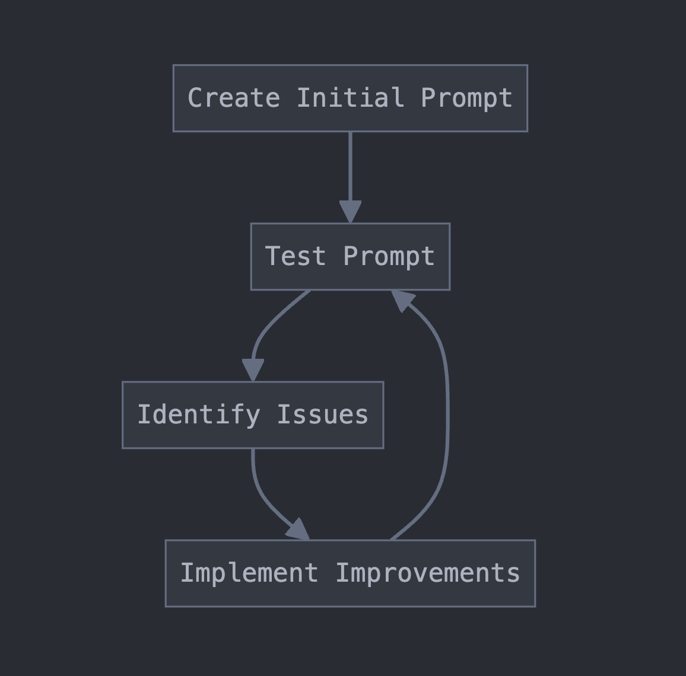

# Lesson 3: Prompt engineering

In the first lesson, we quickly reviewed some key prompting tips. In the second lesson, we wrote a prompt that "blindly" applied all of those tips to a single prompt. Understanding these tips is critical, but it's equally important to understand the prompt engineering workflow and decision making framework.

---

## What is prompt engineering?

Prompt engineering is the art and science of crafting effective instructions for large language models like Claude to produce desired outputs. At its core, prompt engineering involves designing, refining, and optimizing the text inputs (prompts) given to models to elicit accurate, relevant, and useful responses. It's about "communicating" with Claude in a way that maximizes the model's understanding and performance on a given task. The importance of prompt engineering cannot be overstated:

* Enhancing AI capabilities: Well-engineered prompts can dramatically improve an AI's performance, enabling it to tackle complex tasks with greater accuracy and efficiency.
* Bridging the gap between human intent and AI output: Prompt engineering helps translate human objectives into language that AI models can effectively interpret and act upon.
* Optimizing resource usage: Skilled prompt engineering can reduce token usage, lowering costs and improving response times in production environments.

### How is it different from "basic prompting"?

Let's define "basic prompting" as simply asking an AI model a question or giving it a straightforward instruction. Prompt engineering, on the other hand, is a more sophisticated and deliberate process.

* Complexity: Basic prompting often involves single-turn interactions with simple queries. Prompt engineering, on the other hand, may involve multi-turn conversations, complex instructions, and carefully structured inputs and outputs.
* Precision: Basic prompts might be vague or ambiguous, leading to inconsistent results.  This might be fine in one-off prompt situations but won't scale to production use cases.  Engineered prompts are precise, leaving little room for misinterpretation by the model.
* Iterative refinement: Unlike basic prompting, which might be a one-off activity, prompt engineering involves systematic testing, analysis, and improvement of prompts over time.
* Scalability: Prompt engineering aims to create prompts that can handle a wide range of inputs and use cases, making them suitable for production environments.

In essence, prompt engineering elevates the interaction with a model from a casual conversation to a carefully orchestrated exchange designed to maximize the model's potential in solving real-world problems **repeatably**.  As we progress through this course, you'll learn the techniques and mindset needed to master this crucial skill.

---

## The prompt engineering lifecycle
It would be nice to sit down at a blank page and craft the perfect prompt on the first try, but the reality is that prompt engineering is an iterative process that involves creating, testing, and refining prompts to achieve optimal performance. 

Understanding this lifecycle is crucial for developing effective prompts and troubleshooting issues that arise. 

1. Initial prompt creation 
2. Testing and identifying issues
3. Selecting appropriate techniques
4. Implementing improvements
5. Iterating and refining

Let's talk about each of these pieces in detail.

### Initial prompt creation 

Start by writing a "first draft" prompt that clearly articulates your end goal.  Ideally, this first attempt incorporates some of the prompting techniques we've previously covered: define the objective, identify key information, structure the prompt well, etc.  Either way, it's highly unlikely the final version of the prompt will resemble this first draft.

### Testing and identifying issues

Now that you have a basic prompt, the next step is to test it against a variety of possible inputs.  Our upcoming prompt evaluations course will cover this process in detail, but it boils down to:
* Prepare test cases: create a diverse set of inputs that cover various scenarios and edge cases.
* Run initial tests: Use your prompt with the prepared inputs and observe the outputs.
* Analyze results: "grade" the model's responses.  This can be done in a variety of ways: via code, human expertise, or using a large language model.

Throughout this testing process, key metrics to keep in mind include:
* Accuracy: Are the outputs correct and relevant?
* Consistency: Does the model perform similarly across different inputs? How does it handle edge cases?
* Completeness: Is all required information included in the outputs?
* Adherence to instructions: Does the model follow all given directions?

### Selecting appropriate techniques
Once you have tested your initial prompt and have identified concrete issues, it's time to make some changes to the prompt. Instead of blindly making improvements, the ideal approach involves the following steps:

* Diagnose root causes: for each identified issue, try to understand why it's occurring.
* Research solutions: Based on your diagnosis, explore prompt engineering techniques that could address the problems.
* Choose techniques: Select the most promising strategies to implement.

### Implementing improvements

Next, actually implement the improvements in your original prompt.  Modify the original prompt to incorporate the techniques that you've selected to target the previously identified problems.  If you're making multiple changes, consider implementing them one at a time to better understand their individual impacts. 

### Iterating and refining
Repeat the above process!

* Retest: Run your updated prompt through the same test cases used initially.
* Compare results: Analyze how the outputs have changed and whether the targeted issues have been resolved.
* Identify new issues: Look for any new problems that may have been introduced by your changes.
* Repeat the cycle: Continue this process of testing, analyzing, and refining until you achieve satisfactory performance.

